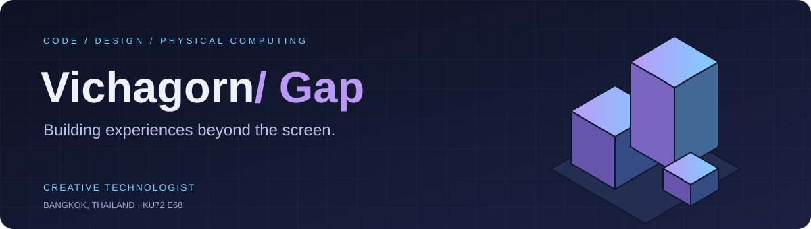
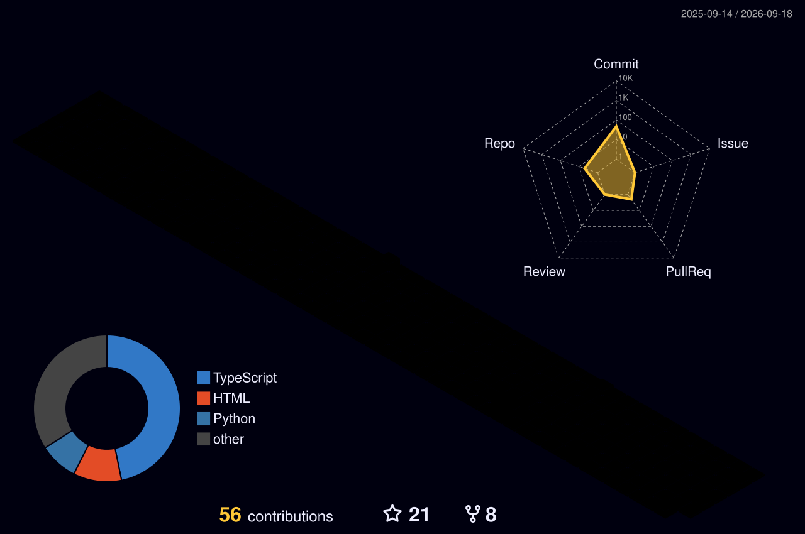
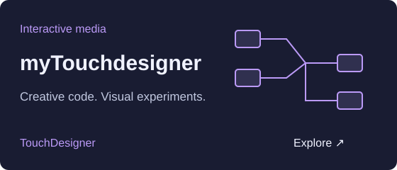
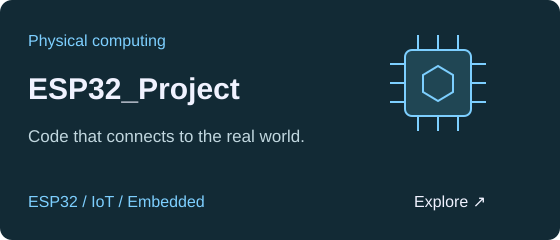

**Interactive experiences · Creative code · Connected hardware**

Bangkok, Thailand · KU72 E68

 

## About

I build immersive digital experiences where code, design, and interactive media meet. I share experiments and workflows on YouTube, ship tools and prototypes in Python and C++, and work a lot with creative coding, TouchDesigner, and embedded hardware (ESP32, Arduino).

 

## Contribution skyline

<picture>
  <source media="(prefers-color-scheme: dark)" srcset="./profile-3d-contrib/profile-night-rainbow.svg" />
  <source media="(prefers-color-scheme: light)" srcset="./profile-3d-contrib/profile-green.svg" />
  
</picture>

A year of building, one contribution at a time. Refreshed daily.

<!-- The profile-3d workflow generates these SVGs on its first run after push. -->

## GitHub / by the numbers

<table>
<tr>
<td valign="top" width="50%">

</td>
<td valign="top" width="50%">

</td>
</tr>
<tr>
<td valign="top" width="50%">

</td>
<td valign="top" width="50%">

</td>
</tr>
</table>

## From pixels to circuits

The tools I use, and the things I build with them.

**Creative code** · Python / C++ / JavaScript 
**Visuals & hardware** · TouchDesigner / ESP32 / Arduino

  
  

A little contribution snake 🐍

<picture>
  <source media="(prefers-color-scheme: dark)" srcset="https://raw.githubusercontent.com/rimand/rimand/output/snake-dark.svg" />
  <source media="(prefers-color-scheme: light)" srcset="https://raw.githubusercontent.com/rimand/rimand/output/snake.svg" />
  
</picture>

---

### Have an idea that goes beyond the screen?

Let's build something interactive.

[**Talk on LinkedIn ↗**](https://www.linkedin.com/in/vichagorn-lupponglung-0671b510b/) &nbsp; · &nbsp; [Watch my experiments on YouTube ↗](https://www.youtube.com/@Vicha.gap_)

Made in Bangkok · Code, design & a little curiosity.

